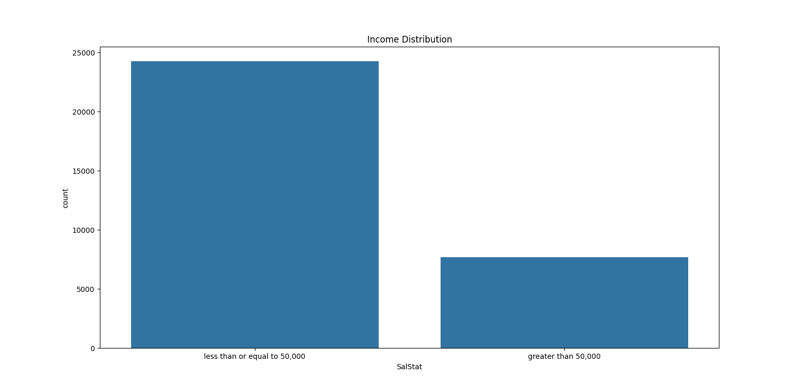

# Income Prediction using Logistic Regression

## Overview
This project predicts whether a person's income exceeds 50K per year using machine learning techniques. It is built using the Adult Income Dataset and applies Logistic Regression for classification.

## Tech Stack
- Python  
- Pandas  
- NumPy  
- Scikit-learn  

## Dataset
- **Name:** Adult Income Dataset  
- Source: UCI Machine Learning Repository  
- Task: Binary classification (Income >50K or <=50K)

## Model
- Logistic Regression (Scikit-learn)

## Data Preprocessing
- Handled missing values  
- Encoded categorical variables  
- Feature scaling applied  
- Train-test split performed  

## Output / Result

- Model Accuracy: 85% (update with your actual value)  
- Model predicts whether income is >50K or <=50K  
- Performance evaluated using classification report  

--
